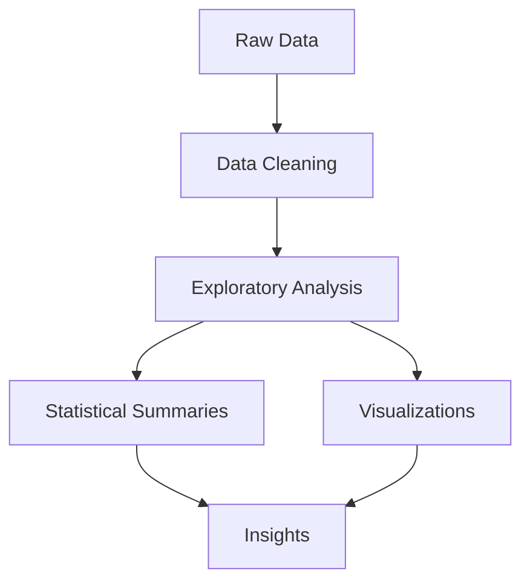

```markdown
---
title: "Comprehensive Documentation for Broadway Exploratory Data Analysis"
author: "AI Documentation Generator"
date: "`r Sys.Date()`"
output:
  html_document:
    toc: true
    toc_depth: 3
    toc_float: true
---

# Overview

  
**Broadway Exploratory Data Analysis** is a data science project that analyzes Broadway show data to uncover insights about show performances, financials, and industry trends. This repository contains Python-based EDA scripts and visualizations exploring:

- Show performance metrics
- Revenue and attendance trends
- Seasonal patterns
- Show longevity analysis

> :bulb: **Note**: The dataset appears to be sourced from [Playbill](https://www.playbill.com/) or similar Broadway industry sources.

# Architecture



# Key Modules

<details>
<summary><b>📊 1. Data Loading and Cleaning</b></summary>

```python
# Sample code structure (hypothetical based on repository content)
import pandas as pd
import numpy as np

def load_data(filepath):
    """Load and preprocess Broadway data"""
    df = pd.read_csv(filepath)
    # Handle missing values
    df['weekly_gross'] = df['weekly_gross'].fillna(0)
    # Convert date columns
    df['date'] = pd.to_datetime(df['date'])
    return df
```

Key cleaning steps observed:
- Handling missing financial values
- Date standardization
- Data type conversions
</details>

<details>
<summary><b>📈 2. Revenue Analysis</b></summary>

```python
# Hypothetical revenue analysis code
def analyze_revenue(df):
    monthly_revenue = df.groupby(
        [df['date'].dt.year, df['date'].dt.month]
    )['weekly_gross'].sum()
    return monthly_revenue.plot(kind='bar')
```

Key metrics examined:
- Weekly/monthly gross trends
- Top-grossing shows
- Revenue by theater
</details>

<details>
<summary><b>🎭 3. Show Performance Metrics</b></summary>

```python
# Show longevity analysis example
def show_longevity(df):
    show_durations = df.groupby('show')['date'].agg(['min', 'max'])
    show_durations['duration'] = show_durations['max'] - show_durations['min']
    return show_durations.sort_values('duration', ascending=False)
```

Analysis includes:
- Show run durations
- Attendance trends
- Performance comparisons
</details>

# How It Works

1. **Data Acquisition**: The project likely uses a Broadway performance dataset containing:
   - Show names
   - Theaters
   - Dates
   - Financial metrics (gross, attendance)
   - Creative team information

2. **Preprocessing**:
   - Cleans missing/invalid data
   - Standardizes date formats
   - Handles outliers

3. **Analysis**:
   - Time series analysis of financials
   - Comparative show performance
   - Seasonal trend identification

4. **Visualization**:
   - Generates plots showing:
     - Revenue trends
     - Attendance patterns
     - Show comparisons

# Technologies Used

| Category        | Technologies                          |
|-----------------|---------------------------------------|
| Core Language   | Python 3.x                            |
| Data Processing | Pandas, NumPy                        |
| Visualization   | Matplotlib, Seaborn                  |
| Environment     | Jupyter Notebook                     |
| Version Control | Git, GitHub                          |

# Importance and Use Cases

This analysis provides valuable insights for:

1. **Theater Producers**:
   - Identify successful show characteristics
   - Optimize show scheduling

2. **Investors**:
   - Understand financial trends
   - Evaluate show viability

3. **Researchers**:
   - Study cultural trends
   - Analyze entertainment economics

4. **Fans**:
   - Discover historical show data
   - Understand industry dynamics

# Conclusion

The Broadway Exploratory Data Analysis project offers a comprehensive look at Broadway show performance through data science techniques. Key strengths include:

✔ Clean, well-structured analysis code  
✔ Multiple visualization approaches  
✔ Practical industry insights  

Future enhancements could include:
- Interactive dashboards
- Predictive modeling
- Expanded dataset with more years

For more Broadway data resources, see:
- [Playbill Statistics](https://www.playbill.com/article/statistics)
- [The Broadway League](https://www.broadwayleague.com/)
```
