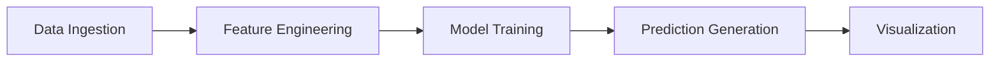

```markdown
---
title: "Comprehensive Documentation for SmartBizForecast"
author: "AI Documentation Generator"
date: "`r Sys.Date()`"
output:
  html_document:
    toc: true
    toc_depth: 3
    toc_float: true
---

# Overview
SmartBizForecast is a predictive analytics tool designed to help businesses forecast key performance metrics such as sales, revenue, and customer demand. This repository provides a robust framework for building, training, and deploying machine learning models tailored to specific business needs. It leverages historical data to generate accurate predictions, enabling businesses to make data-driven decisions.

# Architecture
The architecture of SmartBizForecast consists of the following components:

1. **Data Ingestion**: Collects and preprocesses historical business data.
2. **Feature Engineering**: Extracts meaningful features from raw data.
3. **Model Training**: Utilizes machine learning algorithms to train predictive models.
4. **Prediction Generation**: Produces forecasts based on trained models.
5. **Visualization**: Displays results in an intuitive and actionable format.

Here's a simplified flow:



# Key Modules

## Data Ingestion
This module handles the collection and preprocessing of historical business data. It supports multiple data formats (CSV, Excel, SQL databases) and includes utilities for cleaning and normalizing data.

```python
import pandas as pd

def load_data(file_path):
    """
    Load data from a file
    """
    data = pd.read_csv(file_path)
    return data
```

## Feature Engineering
This module focuses on transforming raw data into meaningful features. It includes techniques like normalization, encoding categorical variables, and creating time-based features.

```python
from sklearn.preprocessing import StandardScaler

def normalize_features(data):
    """
    Normalize features in the dataset
    """
    scaler = StandardScaler()
    scaled_data = scaler.fit_transform(data)
    return scaled_data
```

## Model Training
This module trains machine learning models using historical data. It supports various algorithms such as Linear Regression, Random Forest, and XGBoost.

```python
from sklearn.ensemble import RandomForestRegressor

def train_model(X_train, y_train):
    """
    Train a Random Forest regression model
    """
    model = RandomForestRegressor()
    model.fit(X_train, y_train)
    return model
```

## Prediction Generation
This module generates forecasts based on the trained models. It also includes utilities for evaluating model performance.

```python
def make_predictions(model, X_test):
    """
    Generate predictions using a trained model
    """
    predictions = model.predict(X_test)
    return predictions
```

## Visualization
This module provides functions for visualizing predictions and model performance. It uses libraries like Matplotlib and Seaborn for creating charts and graphs.

```python
import matplotlib.pyplot as plt

def plot_predictions(actual, predicted):
    """
    Plot actual vs predicted values
    """
    plt.figure(figsize=(10, 6))
    plt.plot(actual, label="Actual")
    plt.plot(predicted, label="Predicted")
    plt.legend()
    plt.show()
```

# How It Works
1. **Load Data**: The system starts by loading historical business data.
2. **Preprocess Data**: Data is cleaned and normalized to ensure consistency.
3. **Feature Engineering**: Meaningful features are extracted from the processed data.
4. **Train Model**: A machine learning model is trained using the prepared data.
5. **Generate Predictions**: The trained model is used to forecast future business metrics.
6. **Visualize Results**: Predictions are displayed in a user-friendly format for analysis.

# Technologies Used

Programming Languages:
- Python :heart:

Frameworks and Libraries:
- Pandas :chart_with_upwards_trend: - For data manipulation
- Scikit-learn :wrench: - For machine learning algorithms
- Matplotlib :bar_chart: - For data visualization
- Seaborn :art: - For advanced data visualization
- XGBoost :rocket: - For gradient boosting models

Tools:
- Jupyter Notebook :notebook: - For interactive development
- Git :octocat: - For version control

# Importance and Use Cases
SmartBizForecast is a valuable tool for businesses looking to leverage predictive analytics for strategic decision-making. Key use cases include:
- **Sales Forecasting**: Predict future sales to optimize inventory and staffing.
- **Revenue Projections**: Estimate future revenue for budgeting and planning.
- **Demand Forecasting**: Anticipate customer demand to improve supply chain efficiency.

By providing accurate and reliable forecasts, SmartBizForecast empowers businesses to stay competitive in dynamic markets.

# Conclusion
SmartBizForecast is a comprehensive predictive analytics solution designed to meet the needs of modern businesses. Its modular architecture, robust feature set, and user-friendly design make it an indispensable tool for data-driven decision-making. Whether you're a small business or a large enterprise, SmartBizForecast can help you unlock the full potential of your data.

For further exploration, visit the [GitHub repository](https://github.com/ndegwaanth/SmartBizForecast).
```
