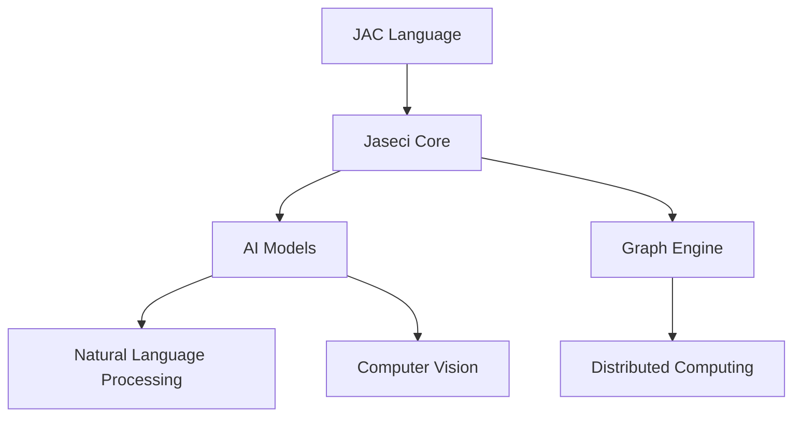
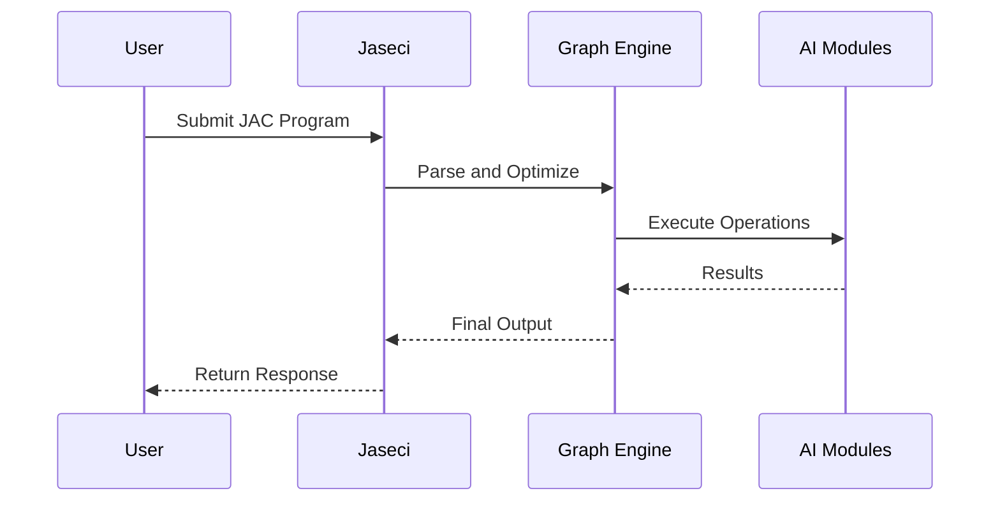

```markdown
---
title: "Comprehensive Documentation for Jaseci"
author: "AI Documentation Generator"
date: "`r Sys.Date()`"
output:
  html_document:
    toc: true
    toc_depth: 3
    toc_float: true
---

# Overview

[](https://www.jaseci.org/)

Jaseci is an open-source framework for building scalable AI applications with graph-based computing. This repository appears to be a fork or mirror of the main [Jaseci project](https://github.com/Jaseci-Labs/jaseci).

> **Note**: This documentation is generated based on the repository structure and available files. For official documentation, please refer to the [Jaseci Docs](https://docs.jaseci.org/).

# Architecture



## Core Components

| Component | Description |
|-----------|-------------|
| JAC Language | Domain-specific language for AI workflows |
| Graph Engine | Manages graph-based computation |
| AI Modules | Pre-built AI capabilities (NLP, CV, etc.) |
| Orchestration | Distributed execution and scaling |
| APIs | REST and GraphQL interfaces |

# Key Modules

## 1. JAC Language

Jaseci's proprietary language for defining AI workflows:

```python
# Example JAC code
walker init {
    root = spawn here --> graph::example;
    take --> node::root;
    report root;
}
```

<details>
<summary>JAC Language Features</summary>

- Graph traversal semantics
- Built-in AI operations
- Parallel execution constructs
- Type system for AI components

</details>

## 2. Core Engine

The main execution environment:

```python
from jaseci.jsorc.jsorc import JsOrc

# Initialize the engine
js = JsOrc()
js.save_glob("config", {"option": "value"})
```

## 3. AI Modules

Pre-built AI capabilities:

```python
from jaseci.actions.live_actions import load_module_actions

# Load NLP module
load_module_actions("jac_nlp")
```

# How It Works

1. **Define Workflows**: Create JAC programs describing AI pipelines
2. **Execute**: Runtime processes the graph-based workflows
3. **Scale**: Distributed execution across nodes
4. **Integrate**: Connect with external systems via APIs



# Technologies Used

## Core Technologies

| Technology | Purpose | Version |
|------------|---------|---------|
| Python | Main implementation language | 3.7+ |
| GraphQL | API interface | - |
| FastAPI | REST endpoints | - |
| Redis | Distributed coordination | - |
| Docker | Containerization | - |

## AI Components

| Module | Capability |
|--------|------------|
| jac_nlp | Natural Language Processing |
| jac_vision | Computer Vision |
| jac_misc | Miscellaneous utilities |
| jac_speech | Speech processing |

## Development Tools

| Tool | Usage |
|------|-------|
| Pytest | Testing framework |
| Black | Code formatting |
| Mypy | Type checking |
| Pre-commit | Git hooks |

# Importance and Use Cases

## Business Value

- **Rapid AI Development**: Build complex AI systems with minimal code
- **Scalability**: Designed for enterprise-scale deployments
- **Maintainability**: Graph-based approach simplifies complex workflows

## Technical Applications

1. **Conversational AI**: Chatbots and virtual assistants
2. **Knowledge Graphs**: Enterprise knowledge management
3. **Recommendation Systems**: Personalized content delivery
4. **Process Automation**: AI-driven workflow automation

# Conclusion

Jaseci represents an innovative approach to AI application development, combining graph computing with modular AI capabilities. The framework is particularly valuable for:

- Teams building complex AI systems
- Organizations needing scalable AI infrastructure
- Developers wanting to abstract away AI implementation details

For more information:
- [Official Website](https://www.jaseci.org/)
- [Documentation](https://docs.jaseci.org/)
- [Community Forum](https://forum.jaseci.org/)
```
